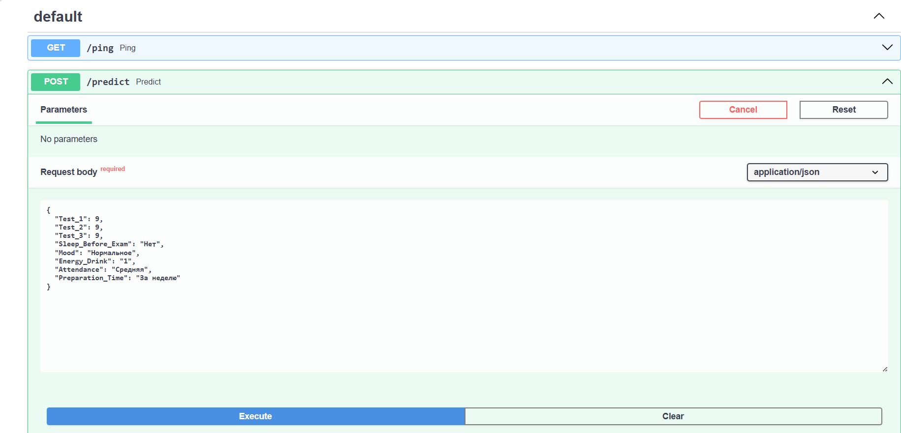
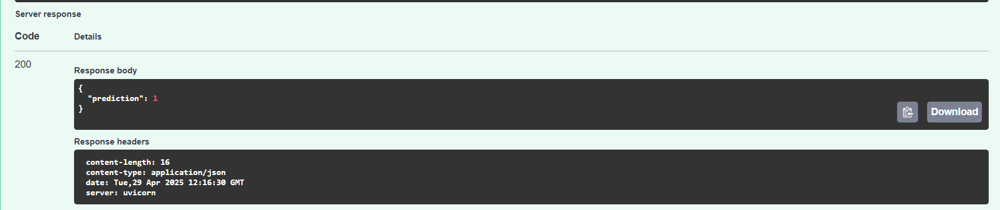

# Ifortex Exam Result Prediction API

## 1. Task Implementation Summary

During this task, I developed a FastAPI application that serves a machine learning model for predicting exam results. The implementation involved:

- Setting up a FastAPI web server.
- Loading a pre-trained CatBoost classification model.
- Defining a Pydantic data model for input validation.
- Creating two API endpoints: one for health checks and one for making predictions.
- Ensuring the application is ready for deployment and easy to run.

## 2. Model Description

The model used in this project is a **CatBoostClassifier**, a gradient boosting algorithm that is particularly effective for categorical features and tabular data. The model was trained to predict exam results based on a set of numerical and categorical input features. The training process likely involved optimizing for classification metrics such as accuracy, F1-score, and ROC-AUC, leveraging CatBoost's ability to handle categorical variables natively.

## 3. API Endpoints

The application exposes two endpoints:

### `/ping` (GET)

- **Purpose:** Health check endpoint to verify that the API is running.
- **Response:**  
  ```json
  {
    "message": "200 OK"
  }
  ```

### `/predict` (POST)

- **Purpose:** Returns a prediction from the CatBoost model based on the provided input features.
- **Request Body:**  
  ```json
  {
    "Test_1": int,
    "Test_2": int,
    "Test_3": int,
    "Sleep_Before_Exam": str,
    "Mood": str,
    "Energy_Drink": str,
    "Attendance": str,
    "Preparation_Time": str
  }

  Keep in mind that u can write only next option: 
  1. For `Sleep_Before_Exam` u can set "Да" or "Нет";
  2. For `Mood` u can set "Хорошее", "Плохое", "Нормальное"; 
  3. For `Energy_Drink` u have next option "4+" "1" "2-3" "0"; 
  4. For `Attendance` u can set "Низкая", "Средняя", "Высокая"; 
  5. For `Preparation_Time` u can choose "За неделю", "Последний час", "Последняя ночь", "За несколько дней".
  ```
- **Response:**  
  ```json
  {
    "prediction": int
  }
  ```
  Input Example: 
  
  
  Output Example: 
  
## 4. Running the FastAPI Application

To run the FastAPI app, use the following command in your terminal:

```bash
uv run main.py
```

This will start the server, and you can access the API at `http://localhost:8000`.

---

**Note:**  
Make sure you have all dependencies installed (see `pyproject.toml`) and that the CatBoost model file exists at `/workspaces/ifortex/models/catboost_model.cbm`.


## 5. Further Improvements

### Add SHAP Value Analysis

To better understand which features have the most impact on the model's predictions, I can integrate SHAP (SHapley Additive explanations) value analysis. SHAP provides visualizations and quantitative insights into feature importance for each prediction, helping you interpret the model's decisions and build trust with stakeholders. By adding SHAP, you can:

- Visualize global and local feature importance.
- Explain individual predictions to end-users.
- Detect potential biases or unexpected model behavior.

**Example improvement:**  
Add a new endpoint (e.g., `/explain`) that returns SHAP values for a given input, or generate SHAP summary plots during model evaluation.

### Add a Dockerfile

Containerizing the application with Docker will make it easier to deploy and run in any environment, ensuring consistency across development, testing, and production. A Dockerfile defines all dependencies and setup steps, so you can launch the app with a single command, regardless of the host system.

**Benefits of Dockerization:**

- Simplifies deployment and scaling.
- Ensures consistent environments for all users.
- Makes it easy to share and run the app on any machine with Docker installed.
- Facilitates integration with CI/CD pipelines and cloud platforms.

**Example improvement:**  
Create a `Dockerfile` that installs all dependencies, copies the code and model, and sets the default command to run the FastAPI app. Then, you can build and run the container with:

```bash
docker build -t ifortex-app .
docker run -p 8000:8000 ifortex-app
```